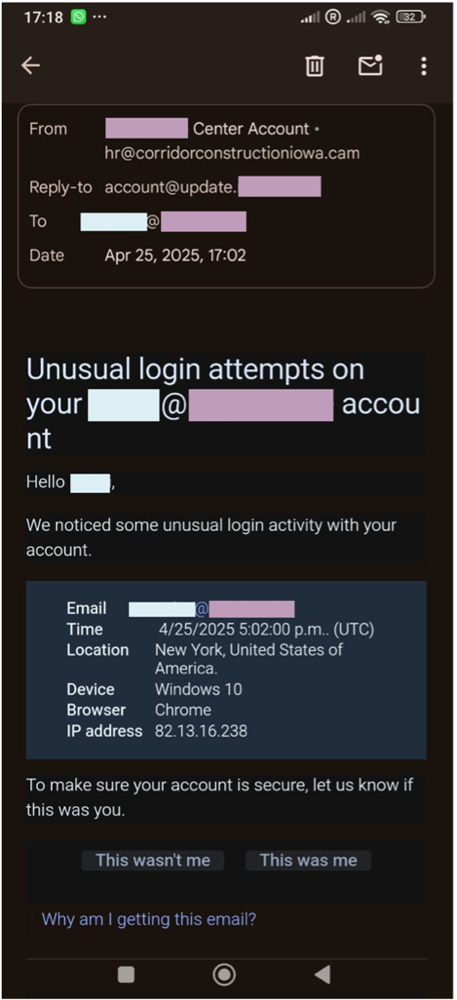
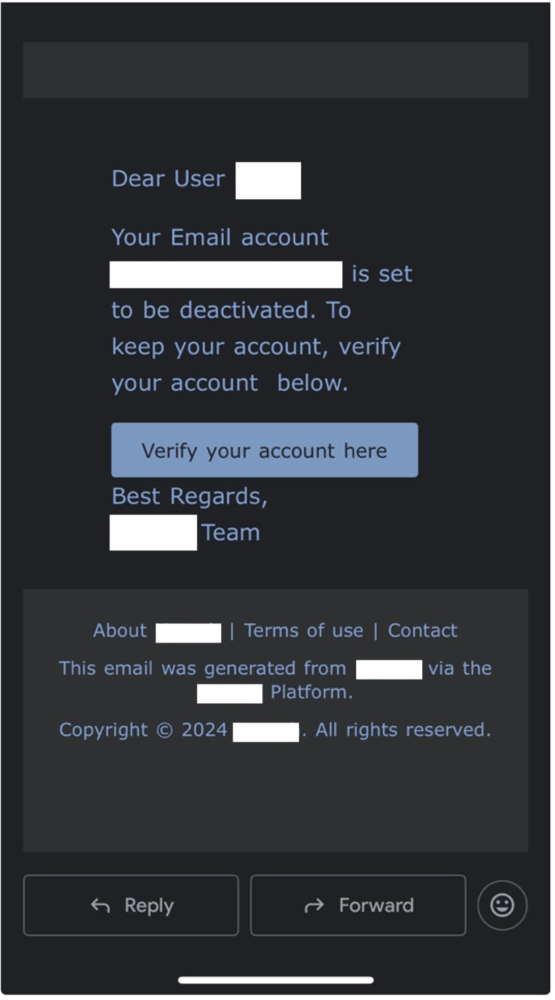
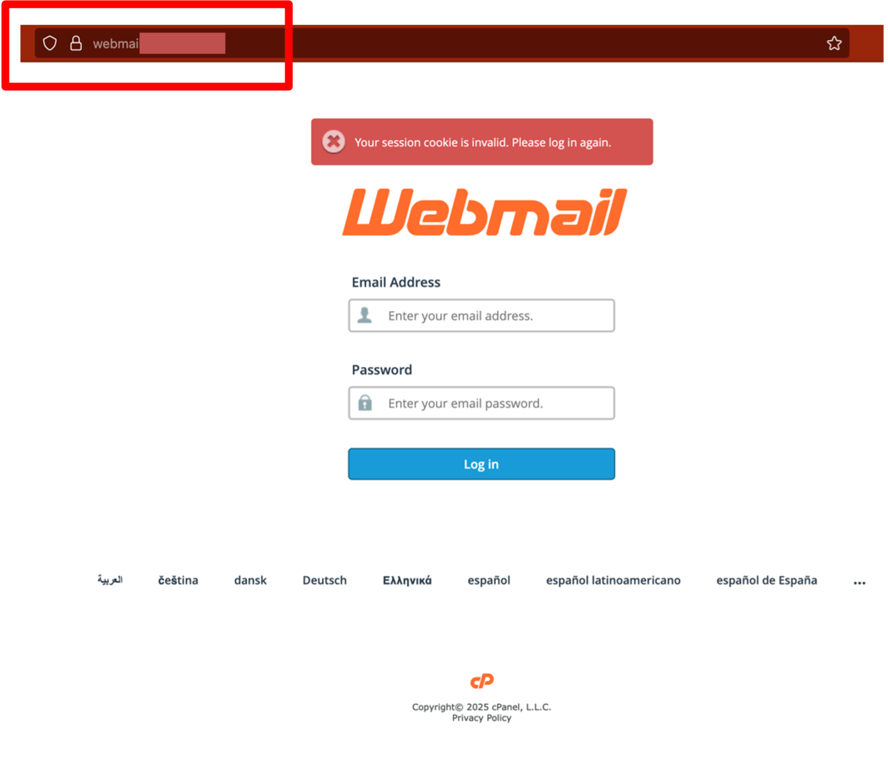
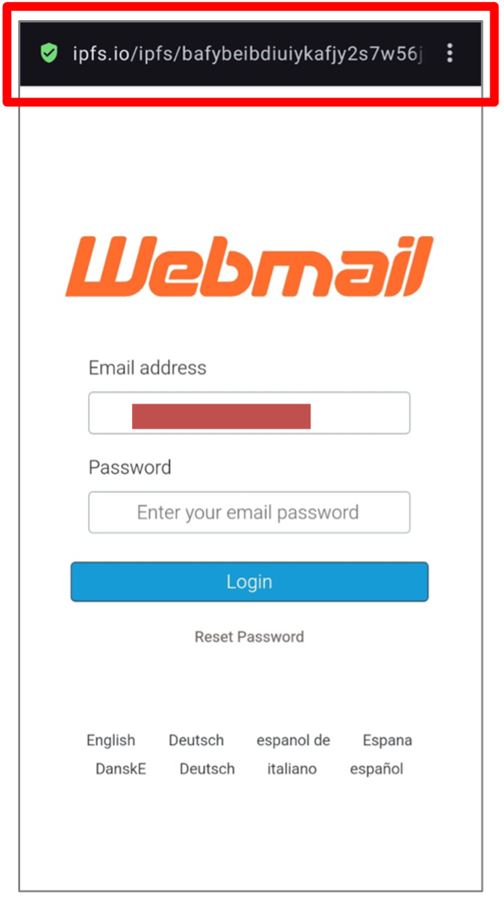
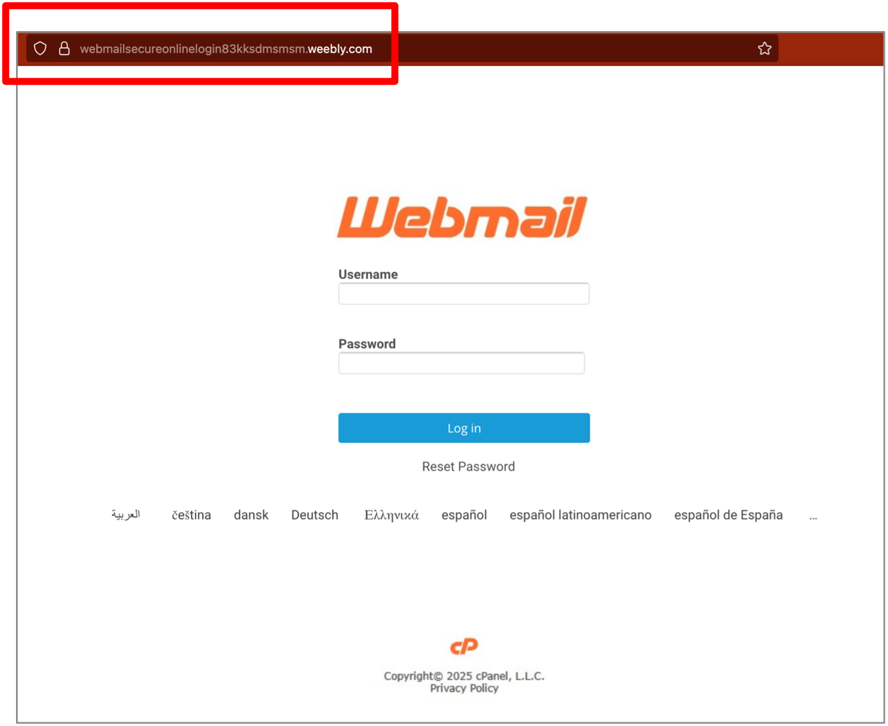
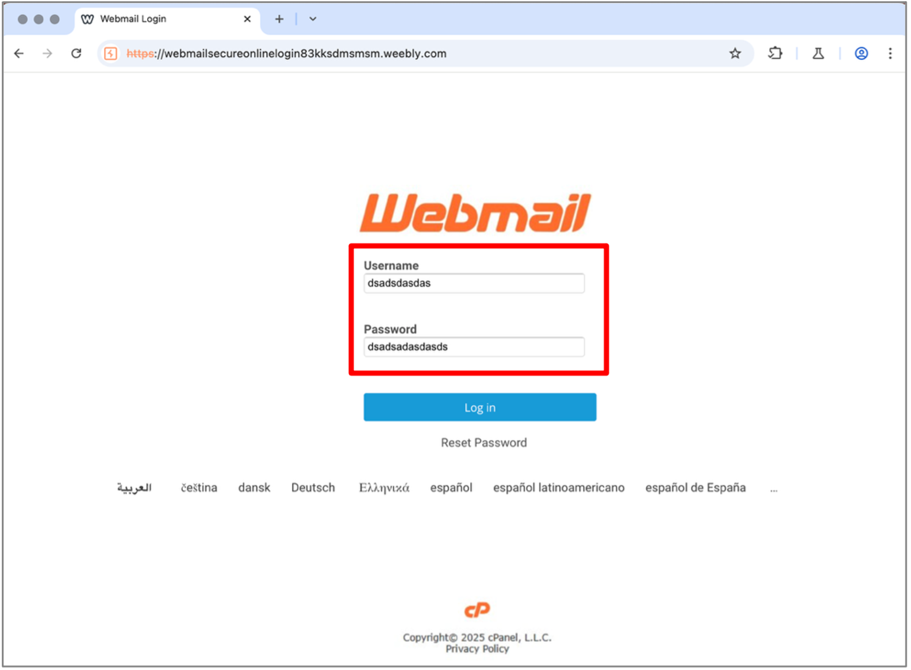
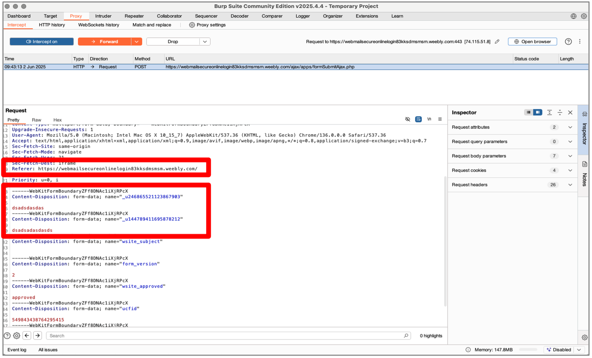

# 4 Email Analysis

## 4.1 Pretexts

The attackers leveraged psychological social engineering tactics like **urgency**, by raising sensitive issues such as unauthorized access and account deactivation, and **authority**, by posing as HR (first phishing attempt, March 2025, Figure 1) and as the company’s own email platform support (second attempt, June 2025, Figure 2).

  

    
    
Figure 1: Pretext of the first email

  

  

    
    
Figure 2: Pretext of the second email

  

## 4.2 Cloned Pages

In this section we’ll examine the cloned pages from the **first** and **second** attacks, contrasted with the **official page**.

On the **official page** (below), you can see the correct URL and that the site uses HTTPS.

  

    
    
Figure 3: Official page

  

In the **first** clone, the URL is completely different from the original, and the user’s email is already pre-filled. The languages listed below are also badly written. In the **second** clone, the attacker used a web hosting provider; you can see the same language display issues, and the input boxes look unprofessional.

  

    
    
Figure 4: First clone

  

  

    
    
Figure 5: Second clone

  

## 4.3 Attacker’s Objective

Based on the cloned login pages and the analysis done with BurpSuite, the phishing campaign aimed to harvest the target’s credentials. Spoofing the email address and using it as the sender makes credential exposure and potential data leakage far easier, jeopardizing both the target’s privacy and that of the clients they serve.

In Figure 6, you can see that when you click the Log in button, the credentials are sent via a POST request to a malicious server, also highlighted in the image. Note that the data is transmitted in plaintext, meaning it’s completely unencrypted.

  

    
    
Figure 6: Example of credential submission

  

  

    
    
Figure 7: POST request

  

**Previous:** [Objectives](https://github.com/e-v-s/CTI-case-study/blob/main/docs/03-objetivos.md)

**You're here:** [Email analysis](https://github.com/e-v-s/CTI-case-study/blob/main/docs/04-analise-dos-emails.md)

**Next:** [Source code analysis - First email](https://github.com/e-v-s/CTI-case-study/blob/main/docs/05-analise-source-code-prim-email.md)
