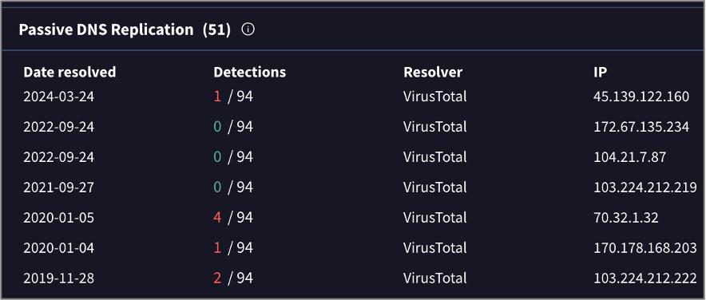
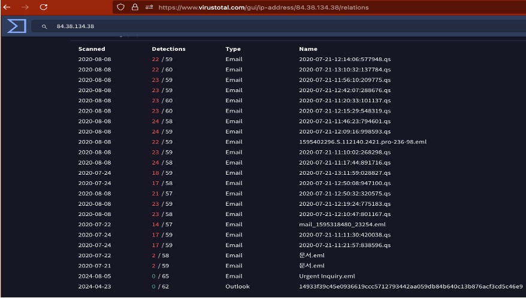
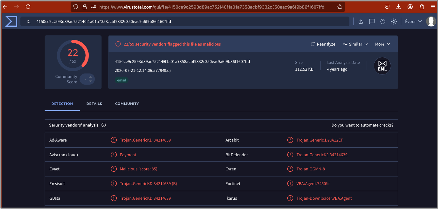

# 5 Source Code Analysis – First Phishing Attempt

Here we’ll analyze the source code of the first phishing attempt, diving deeper into the relevant header sections.

## 5.1 Received Chain

The received chain is formed by the servers that handled the email, including the recipient’s server. We trace it by reading the source code from top → bottom.

At the top is the most recent hop (usually the recipient’s server), while at the bottom is the oldest hop, i.e., the originating server.

These elements are important because every server’s IP address is visible in the source, letting us reconstruct the email’s path—but IPs alone aren’t a fully reliable intel source.

On the **first block** we see the last contact point (most recent server): `cpanel-003-fra.hostingww.com` using LMTP. That’s the client’s email provider.

```
  X-Mozilla-Status: 0001
  X-Mozilla-Status2: 00000000
  Return-Path: <hr@corridorconstructioniowa.cam>
  Delivered-To: ceo@msolutions.com
  Received: from cpanel-003-fra.hostingww.com
    by cpanel-003-fra.hostingww.com with LMTP
    id EGKZEk+WC2jNvzYA2p0M4Q
    (envelope-from <hr@corridorconstructioniowa.cam>)
    for <ceo@msolutions.com>; Fri, 25 Apr 2025 14:03:59 +0000
  Return-path: <hr@corridorconstructioniowa.cam>
  Envelope-to: ceo@msolutions.com
  Delivery-date: Fri, 25 Apr 2025 14:03:59 +0000
```


On the **second block** we have another server, IP `148.113.172.133` at `vps-58680c2d.vps.ovh.ca`. Here the sending server announces itself with `helo=mail.corridorconstructioniowa.cam`, and the client’s server accepts the message. The `helo` acts as an SMTP handshake—vital for verifying server legitimacy.

___
<div style="font-family: 'Courier New';">
  <mark>Received: from vps-58680c2d.vps.ovh.ca ([148.113.172.133]:46792 helo=mail.corridorconstructioniowa.cam)</mark><br>
    by cpanel-003-fra.hostingww.com with esmtps (TLS1.3) tls TLS_AES_256_GCM_SHA384<br>
    (Exim 4.98)<br>
    (envelope-from <hr@corridorconstructioniowa.cam>)<br>
    id 1u8Jep-0000000FOHA-1KmS<br>
    for ceo@msolutions.com;<br>
    Fri, 25 Apr 2025 14:03:59 +0000<br>
  DKIM-Signature: v=1; a=rsa-sha256; c=relaxed/simple;<br>
    d=corridorconstructioniowa.cam; s=202502; t=1745589723;<br>
    bh=27SJj8BZJ8l+ac4w7EED3uS3UQaeMwpWWY+B6MYbbRw=;<br>
    h=Reply-To:From:To:Subject:Date:From;<br>
</div>
___

VirusTotal didn’t flag the domain or IP, but it did return a noteworthy certificate detail for `148.113.172.133`:

___

<div style="font-family: 'Courier New';">
  Last HTTPS Certificate

  Version: V3
  Serial Number: 44b7fa66fb131cc97692a8cf0eb4bfe7ef3<br>
  Thumbprint: b3c9900fa0b35cfb1e3dede8df0a24496a1de2ab<br>
  Signature Algorithm: <br>
  Issuer: C=US O=Let's Encrypt CN=E5 <br>
  Validity <br>
  Not Before: 2024-06-12 11:21:39<br>
  Not After: 2024-09-10 11:21:38<br>
  <mark style="background-color: rgb(211, 228, 59);">Subject: CN=referidos.packsporno.com</mark><br>
  …
  Authority Information Access:
  
  OCSP - http://e5.o.lencr.org<br>
  CA Issuers - http://e5.i.lencr.org/
</div>

____


Key takeaways:

1. The CN points to a dubious site.  
2. The issuing CAs aren’t top-tier.  
3. The cert is expired.

The email also routed through Canada before final delivery, per WHOIS details for the hosting.

A passive DNS lookup shows several IPs tied to that CN, some carrying malicious flags:

<div style="display: flex;">
  <div style="justify-items: center; margin: 50px;">
    
    <p>Figure 8: IPs recorded by passive DNS.</p>
  </div>
</div>

In the **third block**, the earliest hop, we see the likely origin server. VirusTotal has no info on `ip-134-38.dataclub.info`, but it shows details for IP `84.38.134.38`, hosted in Latvia. Oddly, no vendor flagged it either way.

<div style="font-family: 'Courier New';">
  <mark>Received: from ip-134-38.dataclub.info (unknown [84.38.134.38])  
  by mail.corridorconstructioniowa.cam (Postfix) with ESMTPSA id 154A88D745</mark><br>
  for &lt;ceo@msolutions.com&gt;; Fri, 25 Apr 2025 14:02:02 +0000 (UTC)
</div>

The IP details list a Latvian company and address—but attackers could be masking via VPN/Tor.

Over 23 files on VirusTotal reference that IP, all tied to email, like Trojans, but the flags are generic, so we can’t pin down a specific malware.

<div style="display: flex;">
  <div style="justify-items: center; margin: 50px;">
    
    <p>Figure 10: Files embedding IP 84.38.134.38.</p>
  </div>
</div>

All detections point to trojan-style behavior; no definitive link to the phishing URL itself.

<div style="display: flex;">
  <div style="justify-items: center; margin: 50px;">
    
    <p>Figure 11: Trojan detections.</p>
  </div>
</div>

## 5.2 Return-Path

The return path is the envelope-from address. We see it highlighted in the **first block**:

___
<div style="font-family: 'Courier New';">
  X-Mozilla-Status: 0001<br>
  X-Mozilla-Status2: 00000000<br>
  <mark>Return-Path: &lt;hr@corridorconstructioniowa.cam&gt;</mark><br>
  Delivered-To: ceo@msolutions.com<br>
  Received: from cpanel-003-fra.hostingww.com<br>
    by cpanel-003-fra.hostingww.com with LMTP<br>
    id EGKZEk+WC2jNvzYA2p0M4Q<br>
    <mark>(envelope-from &lt;hr@corridorconstructioniowa.cam&gt;)</mark><br>
    for &lt;ceo@msolutions.com&gt;; Fri, 25 Apr 2025 14:03:59 +0000<br>
  Return-path: &lt;hr@corridorconstructioniowa.cam&gt;<br>
  Envelope-to: ceo@msolutions.com<br>
  Delivery-date: Fri, 25 Apr 2025 14:03:59 +0000<br>
</div>
___

The address `hr@corridorconstructioniowa.cam` might exist, but the domain doesn’t. Corridor Construction Iowa is a real company, likely a victim of TLD-squatting.

<div style="display: flex;">
  <div style="justify-items: center; margin: 50px;">
    
    <p>Figure 12: Legitimate company website.</p>
  </div>
</div>

**Previous:** [Email analysis](https://github.com/e-v-s/CTI-case-study/blob/main/docs/04-analise-dos-emails.md)

**You're here:** [Source code analysis - First email](https://github.com/e-v-s/CTI-case-study/blob/main/docs/05-analise-source-code-prim-email.md)

**Next:** [Sandbox analysis - First email](https://github.com/e-v-s/CTI-case-study/blob/main/docs/06-analise-com-HA-prim-email.md)
