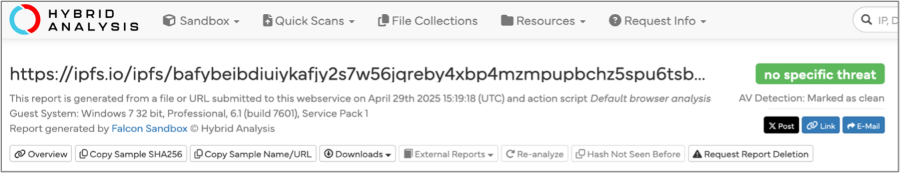
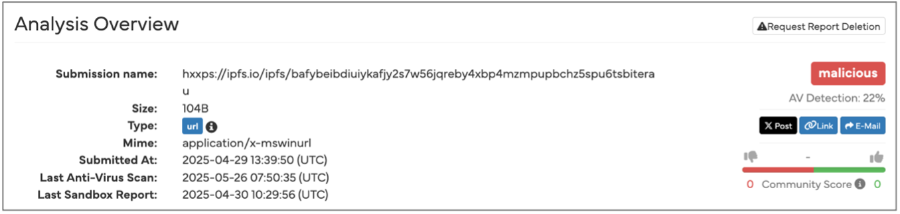
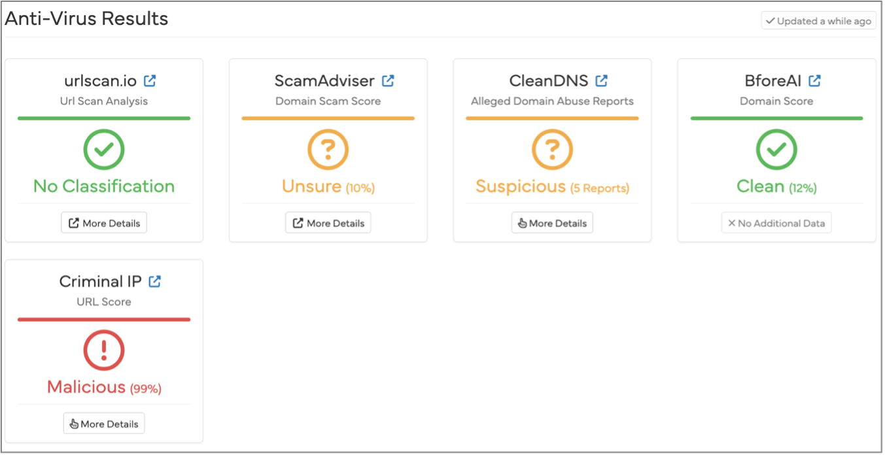
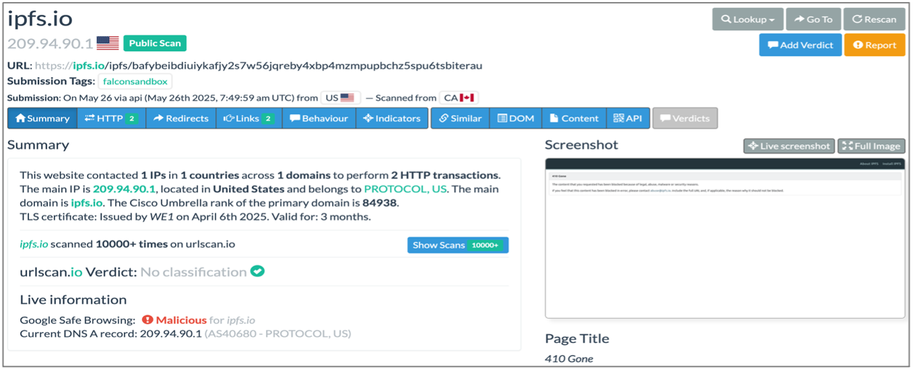
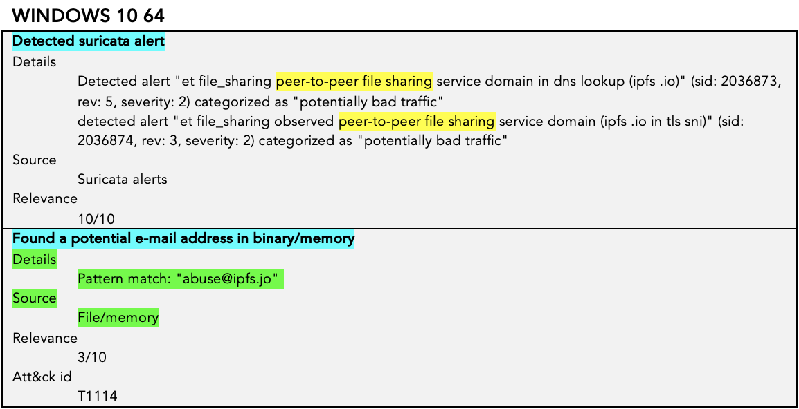
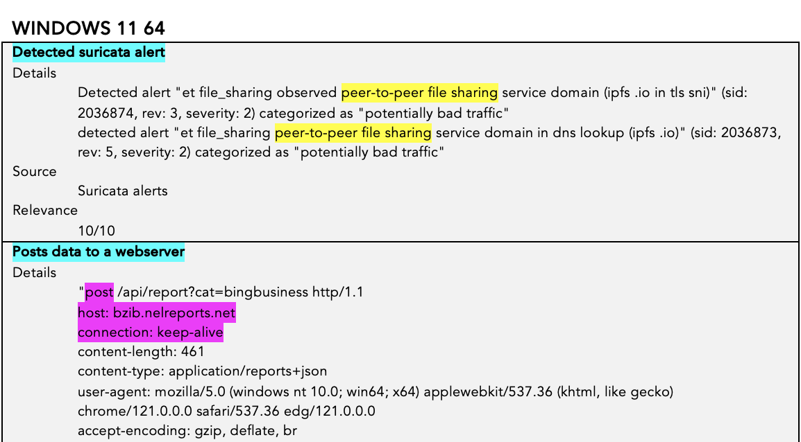

# 6	Análise do Link Usando Hybdrid Analysis – Primeira Tentativa de Phishing

Como já explicado no tópico *“4. Análise do Design”*, os botões redirecionavam para um link, no caso:
``ipfs[.]io/ipfs/bafybeibdiuiykafjy2s7w56jqreby4xbp4mzmpupbchz5spu6tsbiterau``.

Neste tópico foi usada a ferramenta Hybrid-Analysis, criada pela Payload Security e que agora faz parte do CrowdStrike. Serve para análise de arquivos e URLs e usa ambientes do tipo sandbox com o objetivo de detectar comportamentos maliciosos sem comprometer a infraestrutura local.

O usuário faz o upload de um arquivo ou link, a ferramenta o executa em uma VM controlada e registra os resultados da interação com o arquivo/link, como:

  - Análise comportamental (mudanças no registry, conexões de rede, processos, criações de arquivos);
  - Indicadores de Comprometimento (IoCs);
  - Comportamento de rede (resquests DNS, tráfego HTTP/HTTPS, IPs contactados);
  - Mapeamento das Táticas, Técnicas e Procedimentos (TTPs) usando o Mitre ATT&CK;
  - Resultados de escaneamento de antivírus usando o virustotal.

Foram examinadas as seguintes sessões da página carregada após o envio do link:

  - Analysis Overview
  - Anti-virus (AV) Scanner Results
  - Falcon Sandbox Reports
  - Relations
  - Incident Response
  - Additional Context

## 6.1. Analysis Overview

A primeira análise foi feita em março. Até 29 de abril a análise retornava a flag **no specific threat**, como podemos obervar na figura abaixo:

  

    
    
Figura 13: Link do primeiro email.

  

Em 26 de maio foi realizada uma nova análise e a flag mudou para **malicious**. A depender do ambiente da sandbox, a flag muda para *ambiguous*. Neste último caso o antivírus detecta o link como malicioso, mas a sandbox não encontra nenhum comportamento estranho.

  

    
    
Figura 14: Link do primeiro email.

  

## 6.2 AV Scanner Results

A ferramenta faz o escaneamento da URL usando cinco ferramentas, são elas urlscan.io, ScamAdviser, CleanDNS, BforeAI e Criminal IP.

  

    
    
Figura 15: Link do primeiro email.

  

### 6.2.1 Urlscan.io

Esta ferramenta registra a atividade de rede do IP, o conteúdo da página, os metadados e também faz uma análise comportamental com o objetivo de detectar phishing. Neste caso, Hybrid-Analysis retorna a flag **No Classification**, mas se clicarmos em *More Details* teremos duas informações: o Google Safe Browsing sinalizou o domínio como malicioso e a página tem status HTTP 410:

  

    
    
Figura 16: Link do primeiro email.

  

### 6.2.2 ScamAdviser

Esta ferramenta é baseada em votos da comunidade. Os reports de que é um scam são recentes, por isso a flag ``Unsure (10%)``.

### 6.2.3 CleanDNS

Os suários do CleanDNS reportaram que o domínio está sendo abusado.

### 6.2.4 Criminal IP

O scan do Ciminal IP sugere que existe uma probabilidade de 99,97% do link estar relacionado a ataques de phishing.

## 6.3 Falcon Sandbox Reports

Por default, Hybrid-Analysis usa três sandboxes:

  - Windows 7 32bit (Win7)
  - Windows 10 64bit (Win10)
  - Windows 11 64bit (Win11)

Farei uma análise crítica comparativa dos indicadores encontrados nos três Sistemas Operacionais (OS), a partir disso será discutida a análise relacionada ao OS mais provável como alvo do ataque.

### 6.3.1 Indicadores Suspeitos

Na primeira parte do relatório gerado pelo Hybrid-Analysis, temos a sessão **Indicators**. Nesta sessão encontramos os indicadores que apontam para uma possível tática, técnica e procedimento (TTP) usados. Estes resultados vêm da execução da URL dentro do ambiente da sandbox, então podemos acompanhar o que ocorre ao clicar no link.

Na tabela seguinte, é possível ver que **os três OS tiveram alertas do Suricata**. O Suricata é uma ferramenta de análise de rede e detecção de ameaças open source, é um software de IDS/IPS. Neste caso o alerta tem relação com compartilhamento de arquivos via P2P, ou seja, existe um tráfego IPFS.

Para além dos alertas do Suricata, o Win7 não gera nenhum outro alerta inicial, então continuaremos com o próximo sistema, o Win10.

O Win10 gerou um alerta interessante associado ao Att&ck ID T1114, que se relaciona à tática de “Coleta” e mais especificamente à “Coleta de Email”. Na matriz Mitre ATT&CK, esta tática está relacionada à coleta de informações sensíveis usando o e-mail de um alvo qualquer. 

  

    
  

  

    
  

  

    
  

Agora seguimos com o Win11, que demonstrou ter um comportamento mais avançado em se tratando de um ataque. Quais seriam os indicadores deste comportamento? 

O Att&ck ID T1041 está relacionado à “Exfiltração de dados através de canais C2”. Vale ressaltar que C2 é um acrônimo para Command and Control, e está associado às ferramentas e técnicas que atacantes usam para manter a comunicação com a infraestrutura alvo. 

Ao clicar no link usando o Win11, a rede do alvo faz um request do tipo POST, usando JSON, para um servidor web: ``host: bzib.nelreports.net``. O que isso significa? Como mostrado no início desse relatório, a página era uma cópia exata da página de login do webmail da empresa. Se o usuário colocasse suas credenciais, provavelmente elas iriam para o servidor do atacante. 
