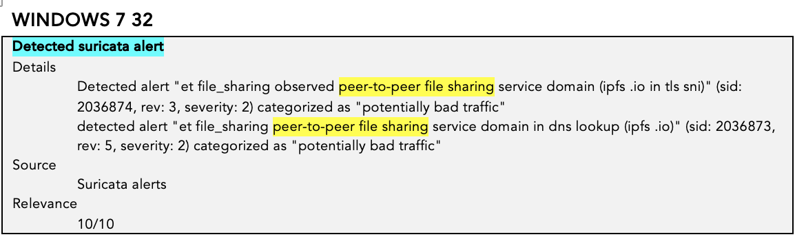

# 6 Analysis of the Link Using Hybrid-Analysis – First Phishing Attempt

As already explained in “4 Email Analysis,” the buttons redirected to a link, in this case:  
``ipfs[.]io/ipfs/bafybeibdiuiykafjy2s7w56jqreby4xbp4mzmpupbchz5spu6tsbiterau``.

In this section we used the Hybrid-Analysis tool, developed by Payload Security and now part of CrowdStrike. It analyzes files and URLs in a sandboxed VM to detect malicious behaviors without risking your local environment.

When you upload a file or link, the tool runs it in a controlled VM and logs interactions, such as:

- Behavioral analysis (registry changes, network connections, processes, file creation)  
- Indicators of Compromise (IoCs)  
- Network behavior (DNS lookups, HTTP/HTTPS traffic, contacted IPs)  
- Mapping of Tactics, Techniques & Procedures (TTPs) using MITRE ATT&CK  
- Antivirus scan results via VirusTotal  

We examined these report sections after submitting the link:

- Analysis Overview  
- Anti-virus (AV) Scanner Results  
- Falcon Sandbox Reports  
- Relations  
- Incident Response  
- Additional Context  

## 6.1 Analysis Overview

The first analysis ran in March. Until April 29, it returned **no specific threat**, as shown below:

  

    
    
Figure 13: Link from the first email.

  

On May 26 a new analysis flagged it as **malicious**. Depending on the sandbox environment, it can also show *ambiguous*, meaning the AV flags it malicious but the sandbox sees no unusual behavior.

  

    
    
Figure 14: Link from the first email.

  

## 6.2 AV Scanner Results

Hybrid-Analysis scans the URL with five services: urlscan.io, ScamAdviser, CleanDNS, BforeAI, and Criminal IP.

  

    
    
Figure 15: Link from the first email.

  

### 6.2.1 Urlscan.io

This tool logs network activity, page content, metadata, and behavioral cues to detect phishing. Here, Hybrid-Analysis shows **No Classification**, but under *More Details* you’ll see Google Safe Browsing marked it malicious and the page returned HTTP 410:

  

    
    
Figure 16: Link from the first email.

  

### 6.2.2 ScamAdviser

Community votes power this tool. Since reports are recent, it shows **Unsure (10%)**.

### 6.2.3 CleanDNS

CleanDNS users reported the domain as abused.

### 6.2.4 Criminal IP

Criminal IP gives a 99.97% probability the link is tied to phishing.

## 6.3 Falcon Sandbox Reports

By default, Hybrid-Analysis runs three sandboxes:

- Windows 7 32-bit (Win7)  
- Windows 10 64-bit (Win10)  
- Windows 11 64-bit (Win11)  

I’ll compare the indicators across these OSes to infer which was the likely target.

### 6.3.1 Suspicious Indicators

In the **Indicators** section, we see alerts tied to potential TTPs. All three OSes triggered **Suricata** alerts (Suricata is an open-source IDS/IPS). Here, it flagged P2P file-sharing traffic, i.e., IPFS activity.

Win7 had no other alerts, so we move on to Win10.

Win10 produced an alert for ATT&CK ID T1114 (Email Collection), which involves harvesting sensitive info via email.

  

    
  

  

    
  

  

    
  

Next, Win11 showed more advanced behavior. It flagged ATT&CK ID T1041 (Exfiltration Over C2 Channel). C2 stands for Command and Control—techniques attackers use to maintain contact with compromised infrastructure.

On Win11, clicking the link triggers a POST request with JSON to `host: bzib.nelreports.net`. Recall the phishing page was a replica of the company’s webmail login—any credentials entered would go straight to the attacker’s server. 

**Previous:** [5 Source code analysis - First email](https://github.com/e-v-s/CTI-case-study/blob/main/docs/05-analise-source-code-prim-email.md)

**You're here:** [6 Sandbox analysis - First email](https://github.com/e-v-s/CTI-case-study/blob/main/docs/06-analise-com-HA-prim-email.md)

**Next:** [7 New attack - Second email](https://github.com/e-v-s/CTI-case-study/blob/main/docs/07-novo-ataque-seg-email.md)

