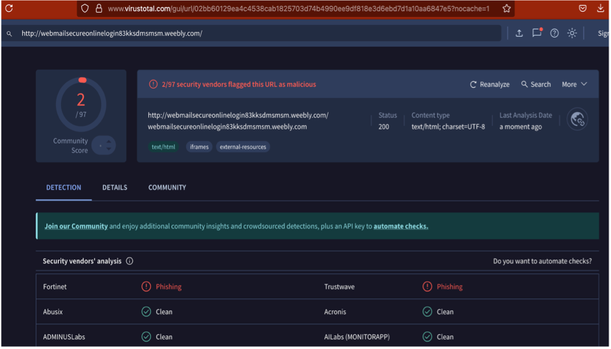
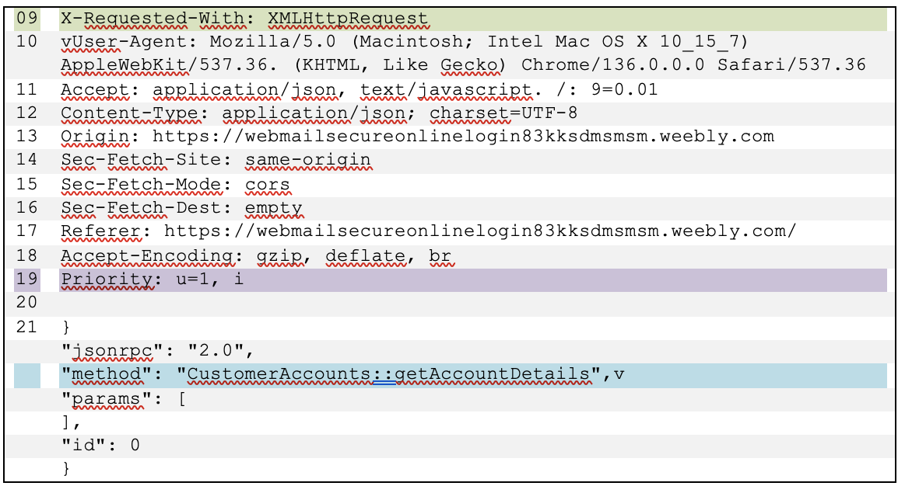
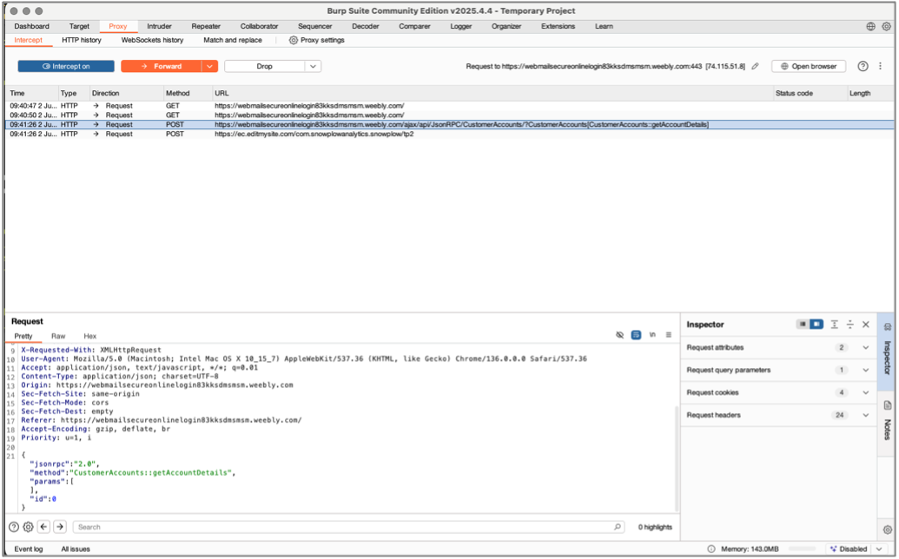
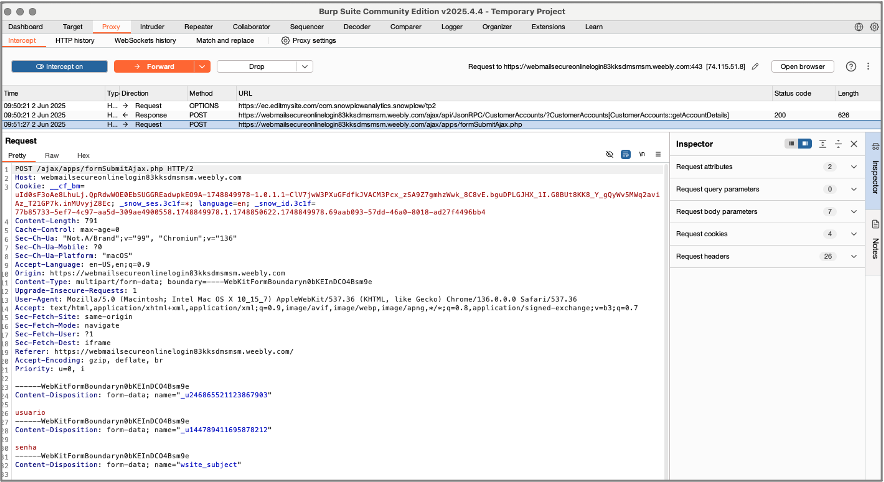

# 7.	Nova Série de Ataques, junho | 2025 – Segunda Tentativa de Phishing

No início de junho, a empresa recebeu o mesmo tipo de ataque. Em um único dia receberam 7 emails de phishing com o mesmo pretexto. Um detalhe muito importante, o atacante usou o mesmo domínio do e-mail corporativo do alvo, um indicativo de spoofing de e-mail do seu próprio domínio. Mas, diferente do ataque passado que usou um e-mail com TLD squatting de outra empresa, neste caso não houve indícios de typosquatting nem nenhuma outra técnica, era realmente um spoofed e-mail se passando por um e-mail de suporte.

A análise com a sandbox do Hybrid-Analysis não retornou nada, provavelmente por ser uma campanha de phishing recente. Os atacantes tem a tendência de criar novos domínios com tempo de vida curto para não serem rastreados, não dando tempo das ferramentas de análise sinalizarem o link como malicioso.

Até o dia 03 de junho o link funcionava, agora, além da página não existir mais, já está sendo sinalizada pelo Google Safe Browsing como um site malicioso.

O link do botão *Verify your account here* desta vez não é um link de compartilhamento via IFPS, mas sim um provedor de domínio legítimo, o Weebly. Este provedor possui um [histórico](https://blog.eclecticiq.com/financially-motivated-threat-actor-leveraged-google-docs-and-weebly-services-to-target-telecom-and-financial-sectors) de ser host para sites de phishing, assim como [vários outros](https://unit42.paloaltonetworks.com/platform-abuse-phishing/). 

 | Link do botão |
 | - |
 | hxxp[://]webmailsecureonlinelogin83kksdmsmsm[.]weebly[.]com/ |

A análise do link no virustotal retornou que duas plataformas sinalizaram como url maliciosa. Porém, não tinha nenhuma informação importante, já que os DETAILS estavam associados ao provedor usado, e não ao atacante.

  

    
    
Figura 20: Análise do link no virustotal

  

## Análise com BurpSuite

Como nada foi encontrado nas ferramentas **virustotal** e **Hybrid-Analysis**, resolvi fazer a análise dos *requests* feitos via HTTP usando o **BurpSuite**.

Assim que a página do link malicioso é carregada, o request abaixo é feito. Na linha 09, é um request do tipo ``XMLHttpRequest`` é um tipo de ``AJAX/XHR call``, carregam geralmente payloads do tipo JSON via função Javascript, os quais são enviados no background da aplicação, sem que a página carregue. Foi feito uma conexão com a api do servidor do atacante.

  

    
    
Figura 21: Header HTTP

  

  

    
    
Figura 22: Requests no BurpSuite

  

Na página, foram colocadas as credenciais **usuário** e **senha** com o objetivo de detectar algo no backend da aplicação. Como mostrado na figura abaixo, foi feito um request ``POST`` para o servidor AJAX do site malicioso, contendo as credenciais em *plaintext*. **Aqui, fica óbvio que o objetivo do ataque era a coleta de credenciais.**

  

    
    
Figura 23: Credenciais

  

