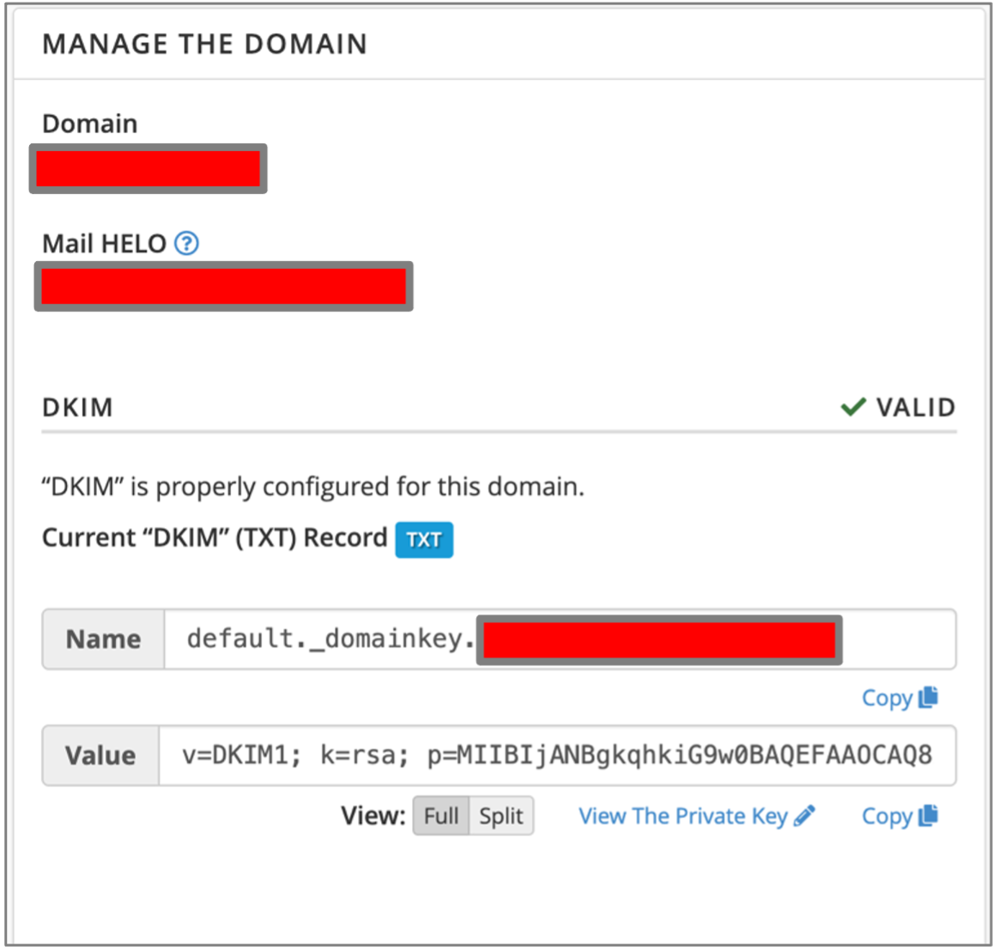
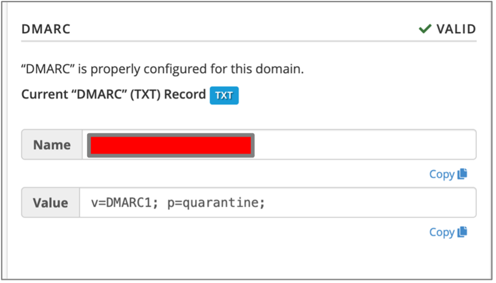

# 8.	Rastreamento de Vulnerabilidades

## 8.1. Email Spoofing

O e-mail spoofing ocorre quando um atacante envia um e-mail se passando por um e-mail ou domínio legítimo. Diferente da técnica de TLD squatting que vimos no primeiro caso de phishing, neste caso o atacante forja o ``From:`` ou outros campos do header do e-mail.

Para exemplificar o ocorrido, como usamos MSolutions como o codinome da empresa, vamos supor que o domínio da empresa seja msolutions.com. O atacante usou um email *no-reply@msolutions.com*, ou seja, cai na característica de ser um spoofed mail. Este email não foi reconhecido pelo servidor do alvo como spam. Existe aí uma falha do próprio domínio e webserver do alvo, pois se o domínio tivesse as proteções necessárias, o servidor do usuário iria reconhecer este spoofed mail como ilegítimo e o recebimento seria rejeitado, no mínimo. Mas, como isso não ocorreu, é prova suficiente para supor que o webmail nem o domínio do alvo estavam protegidos. ``Então, quais proteções são necessárias para evitar um spoofing de email corporativo?``

Existem mecanismos de defesa a serem implementados para que o uso indevido de um domínio seja evitado, são eles: Sender Policy Framework - SPF, DomainKeys Identified Mail - DKIM e Domain-based Message Authentication, Reporting & Conformance - DMARC. Veremos em seguida com detalhes cada um.

## 8.2. SPF

Este framework funciona como um mecanismo de autenticação. Ele permite que o proprietário do domínio publique, no DNS, uma especificação de quais endereços de IP ou hostnames podem enviar emails em nome do domínio. Por *default*, o protocolo de envio de email SMTP não verifica o remetente do email, então um atacante com acesso a qualquer servidor de email pode, simplesmente, usar o campo From: do header do email com qualquer email criado usando o domínio do alvo. Como isto é possível?

No nosso caso, o atacante colocou um endereço arbitrário no From, usando o domínio do próprio alvo *no-reply@msolutions.com*, lembrando que este endereço na verdade não existe. Esta **vulnerabilidade** na configuração do SPF do servidor web do alvo foi explorada pelo atacante. A “sorte” do alvo é que a empresa é pequena e o CEO, quem recebeu o email, sabe quais emails existem na empresa. 

O SPF é colocado na configuração do DNS no registro TXT-Record do domínio principal, que seria, em nosso caso *msolutions.com*. Na plataforma do domínio o SPF estava configurado.

## 8.3. DKIM

O DKIM é um método de autenticação de email, onde o destinatário verifica que um servidor de email autorizado “assinou”, com uma chave criptográfica, a mensagem recebida. Também garante a integridade  da mensagem contra adulteração.

O servidor de email gera um par de chaves pública/privada. A chave pública deve ser publicada no servidor DNS, também no registro TXT-record, mas desta vez no sub-domínio correspondente: default._domainkey.msolutions.com. Com um DKIM registrado, o cliente quando envia um email do seu servidor de email autorizado, tem esse email assinado com a chave  privada. Quando este email chega ao servidor de destino, este extrai o domínio que está no header e busca via DNS a chave DKIM pública deste domínio, recalculando assim o hash gerado pela assinatura e verificando que a mensagem é legítima.

<mark style="background-color: rgb(220, 72, 55);">Na plataforma DNS do domínio o DKIM não estava configurado.</mark> Isso torna o spoofing do domínio de email muito mais fácil para o atacante, e foi o que aconteceu. Além disso, o atacante pode usar spoofed emails para clientes, se passando pelo proprietário do domínio. Alguns servidores de email não entregam emails sem o DKIM configurado, então isso pode impedir também o envio de emails legítimos.

<div style="display: flex;">
  <div style="justify-items: center; margin: 50px;">
    
    <p>Figura 24: Implementação do DKIM</p>
  </div>
</div>

O DKIM foi implementado no domínio da empresa da seguinte maneira. O foi gerado uma chave DKIM no provedor de email e no domínio DNS, no registro, foi adicionado um domínio ``default._domainkey`` e nele adicionado um registro TXT com o valor da chave pública. Com a configuração correta, o provedor de email retorna que o domínio agora possui um DKIM válido.

## DMARC

O DMARC é uma política publicada no DNS, avisando aos servidores de email dos destinatários como lidar com emails que falham na checagem do SPF e/ou do DKIM. É uma política que deve ser publicada no DNS do cliente. 

As políticas usadas no DMARC são **none**, para que quando algum email recebido falhe as checagens o servidor não faça nada; **quarantine**, neste caso o email vai para caixa de spam; e **reject**, para que o email seja recebido.

Para possuir uma política DMARC, o DNS precisa ter SPF e DKIM configurados. Como neste caso o alvo não possuía registro DKIM, <mark style="background-color: rgb(220, 72, 55);">o DMARC também não estava configurado</mark>.

O uso do DMARC também possibilita adicionar emails para enviar resumos diários (parâmetro ``rua``) e relatórios forense (parâmetro ``ruf``) caso o DMARC encontre uma falha, como no exemplo:

```
  v=DMARC1; p=quarantine; rua=mailto:dmarc-aggregate@msolutions.com; ruf=mailto:dmarc-forensic@msolutions.com
```

Também foi configurada a política DMARC no registro DNS do domínio, neste caso foi usado o padrão acima. A imagem ao lado ilustra que uma política simples também retorna como válido. Para que o DMARC seja registrado, é necessário que o domínio tenha primeiro o DKIM válido.

<div style="display: flex;">
  <div style="justify-items: center; margin: 50px;">
    
    <p>Figura 25: Implementação do DMARC</p>
  </div>
</div>

# 9.  Conclusão

Todas as empresas, pequenas e grandes, estão sujeitas a um ataque de spoofing. Com o propósito de evitar o vazamento de credenciais via phishing, protegendo assim a privacidade dos usuários/clientes e também a integridade da empresa, devem ser implementados controles de autenticação de email (SPF, DKIM e DMARC) e monitoramento.

Estes controles reforçam a **confidencialidade**, **integridade** e **disponibilidade**, pilares da segurança da informação, na empresa. E, ao impedir o spoofing de emails e domínios, estes controles reduzem a probabilidade de vazamento de credenciais da empresa, impendindo que:

  - Os colaboradores tenham seus dados expostos por ataques de phishing (confidencialidade);
  - Os sistemas fiquem indisponívels em caso de invasão ocasionada por credenciais vazadas (disponibilidade);
  - Garante a integridade dos emails enviados pela empresa (integridade);
  - E garante que atacantes não usem o domínio da empresa para ataques futuros, que podem inclusive comprometes os clientes da empresa.

